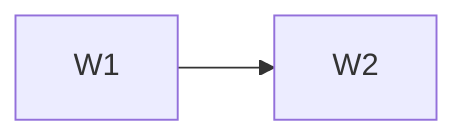

# <Plan Name> Wave Index

This file is the sole mutable authority for wave status and approval evidence.
Decisions: [../../DECISIONS.md](../../DECISIONS.md). Engineering rules:
[../../design.md](../../design.md).

## Gating rules

1. Every wave starts gated.
2. A wave starts only after the owner explicitly approves it and the approval is
   recorded below.
3. Finishing one wave never authorizes the next.
4. Done means the single exit criterion was demonstrated, required tests passed, and
   named published contracts were regenerated and recorded.
5. Published contracts freeze at wave sign-off. A later change requires owner approval
   and a superseding decision.
6. Parallel work is allowed only when every shared dependency is already frozen and
   neither track modifies it.
7. Product, contract, schema/data, security or irreversible conflicts stop affected
   work for a decision. Local reversible assumptions follow `design.md`.
8. Early waves retire the greatest important product uncertainty per unit of
   implementation effort. Visual identity waits until workflow utility is proven.

## Status

Legend: ⏸ gated · 🟡 approved & in progress · ✅ done & signed off

| Wave | Capability | Brief | Status | Approval or sign-off evidence |
|---|---|---|---|---|
| W1 | <capability> | [wave-1-<slug>.md](wave-1-<slug>.md) | ⏸ | — |

## Dependency order

## Parallel tracks

List only track pairs whose shared dependency froze in an earlier signed-off wave.

| Track A | Track B | Shared frozen contract | Why neither track modifies it |
|---|---|---|---|
| <wave> | <wave> | <contract and freeze wave> | <evidence> |
