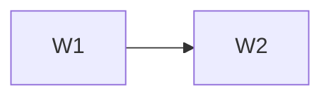

# <Plan Name> Delivery Plan

Standalone-mode output. Governance mode writes directly to `docs/waves/`.

## Findings

1. <Evidence-backed finding and source.>

## Gating rules

Every wave starts gated. The owner explicitly approves each wave. Completion never
authorizes the next wave. Published contracts freeze at sign-off. Parallel tracks are
allowed only over already-frozen shared dependencies.

## Status

Legend: ⏸ gated · 🟡 approved & in progress · ✅ done & signed off

| Wave | Capability | Status | Approval or sign-off evidence |
|---|---|---|---|
| W1 | <capability> | ⏸ | — |

## Dependency graph

## Wave briefs

For every wave, include the complete structure from `assets/wave-brief.md`: objective,
in-scope and deferred work, references, named published contracts, mandatory tests,
one exit criterion, reviewable vertical slices, and sign-off checklist.

## Open items

Track unresolved planning questions in the paired decisions log; never silently drop
deferred work.
