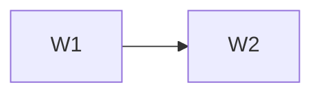

# <Plan Name> Wave Index

This file is the sole mutable wave-status authority.

## Gating rules

1. Every wave starts gated and requires explicit owner approval.
2. Completing a wave never authorizes the next.
3. Published contracts freeze at sign-off.
4. Parallel tracks require already-frozen shared dependencies.
5. Blocking specification or contract conflicts require an owner decision.
6. Early waves retire the greatest important product uncertainty per unit of
   implementation effort. Visual identity and interaction sophistication wait until
   workflow utility is proven.

## Status

Legend: ⏸ gated · 🟡 approved & in progress · ✅ done & signed off

| Wave | Capability | Brief | Status | Approval or sign-off evidence |
|---|---|---|---|---|
| W1 | <capability> | [wave-1-<slug>.md](wave-1-<slug>.md) | ⏸ | — |

## Dependency graph

## Parallel tracks

| Track A | Track B | Shared frozen contract | Why safe |
|---|---|---|---|
| <wave> | <wave> | <contract and freeze wave> | <evidence> |
